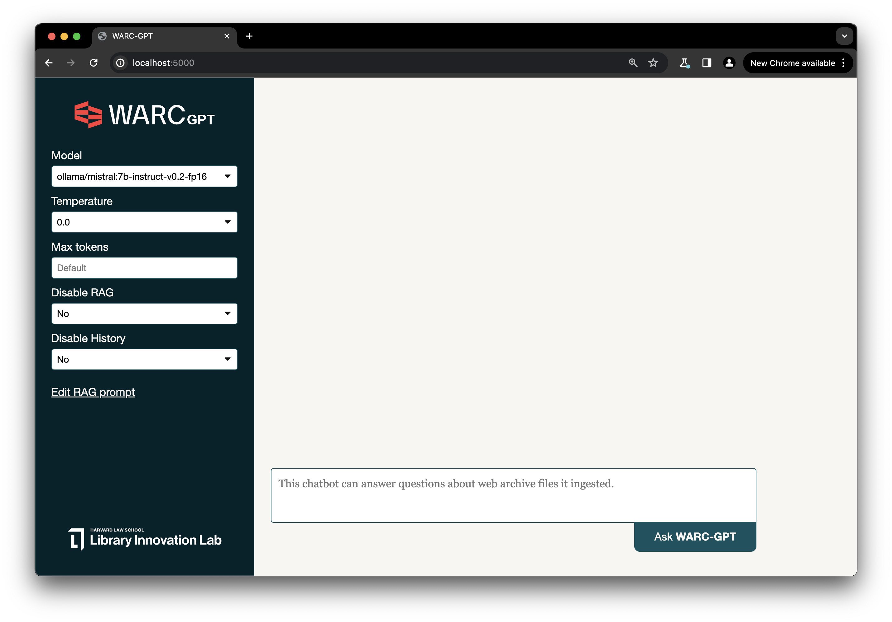

# WARC-GPT

**WARC + AI:** Experimental Retrieval Augmented Generation Pipeline for Web Archive Collections. 

More info:
- <a href="https://lil.law.harvard.edu/blog/2024/02/12/warc-gpt-an-open-source-tool-for-exploring-web-archives-with-ai/">"WARC-GPT: An Open-Source Tool for Exploring Web Archives Using AI"</a>. Feb 12 2024 - _lil.law.harvard.edu_




---

## Summary 
- [Features](#features)
- [Installation](#installation)
- [Configuring the application](#configuring-the-application)
- [Ingesting WARCs](#ingesting-warcs)
- [Starting the server](#starting-the-server)
- [Interacting with the Web UI](#interacting-with-the-web-ui)
- [Interacting with the API](#interacting-with-the-api)
- [Visualizing Embeddings](#visualizing-embeddings)
- [Disclaimer](#disclaimer)

---

## Features
- Retrieval Augmented Generation pipeline for WARC files
- Highly customizable, can interact with many different LLMs, providers and embedding models
- REST API
- Web UI
- Embeddings visualization

[☝️ Summary](#summary)

---

## Installation
WARC-GPT requires the following machine-level dependencies to be installed. 

- [Python 3.11+](https://python.org)
- [Python Poetry](https://python-poetry.org/)

Use the following commands to clone the project and instal its dependencies:

```bash
git clone https://github.com/harvard-lil/warc-gpt.git
poetry env use 3.11
poetry install
```

[☝️ Summary](#summary)

---

## Configuring the application

This program uses environment variables to handle settings. Copy `.env.example` into a new `.env` file and edit it as needed.

```bash
cp .env.example .env
```

By default, `.env` is configured: 
- To use [intfloat/e5-large-v2](https://huggingface.co/intfloat/e5-large-v2) as an embedding model
- To connect to a local instance of [Ollama](https://ollama.ai) for inference
- To use a basic, fairly neutral retrieval prompt 

Edit this file as needed to adjust settings, replace the embedding model, retrieval prompt, or to connect WARC-GPT to [Open AI](https://platform.openai.com/docs/introduction), [Anthropic](https://docs.anthropic.com/claude/reference/getting-started-with-the-api), [Cohere](https://docs.cohere.com/docs) or [Perplexity AI](https://docs.perplexity.ai/).

[☝️ Summary](#summary)

---

## Ingesting WARCs 

Place the WARC files you would to explore with WARC-GPT under `./warc` and run the following command to:
- Extract text from all the `text/html` and `application/pdf` response records present in the WARC files.
- Generate text embeddings for this text. WARC-GPT will automatically split text based on the embedding model's context window.
- Store these embeddings in a vector store, so it can be used as WARC-GPT's knowledge base.

```bash
poetry run flask ingest
```

**Note:** Running `ingest` clears the `./chromadb` folder.

[☝️ Summary](#summary)

---

## Starting the server

The following command will start WARC-GPT's server on port `5000`.

```bash
poetry run flask run
# Not: Use --port to use a different port
```

[☝️ Summary](#summary)

---

## Interacting with the WEB UI

Once the server is started, the application's web UI should be available on `http://localhost:5000`.

Unless the **Disable RAG** option is turned on, the system will try to find relevant excerpts in its knowledge base - populated ahead of time using WARC files and the `ingest` command - to answer the questions it is asked.

The interface also automatically handles a basic chat history, allowing for few-shots / chain-of-thoughts prompting. 

[☝️ Summary](#summary)

---

## Interacting with the API

### [GET] /api/models
Returns a list of available models as JSON.

### [POST] /api/completion
For a given message, retrieves relevant context from the knowledge base and use an LLM to generate a text completion.

<details>
<summary><strong>Accepts JSON body with the following properties:</strong></summary>

- `model`: One of the models `/api/models` lists (required)
- `message`: User prompt (required)
- `temperature`: Defaults to 0.0 (required)
- `max_tokens`: If provided, caps number of tokens that will be generated in response.
- `no_rag`: If set and true, the API will not try to retrieve context.
- `rag_prompt_override`: If provided, will be used in replacement of the predefined RAG prompt. {context} and {question} placeholders will be automatically replaced.
- `history`: A list of chat completion objects representing the chat history. Each object must contain "user" and "content".

</details>

<details>
<summary><strong>Returns a JSON object containing the following properties:</strong></summary>

- `id_exchange`: Unique identifier for this completion
- `response`: Text of the response generated by the LLM
- `response_info`: An object containg technical information about the response that was generated
    - `response_info.completion_tokens`: Number of tokens generated by the LLM.
    - `response_info.prompt_tokens`: Number of tokens passed to the LLM.
    - `response_info.total_tokens`: Total number of tokens
- `request_info`: An object containing information about the request given to the chatbot
    - `request_info.message`: Same as input `message`
    - `request_info.message_plus_prompt`: If RAG is enabled, presents the message alongside the context and retrieval prompt, as it was given to the LLM.
    - `request_info.max_tokens`: Same as input `max_tokens`, if provided.
    - `request_info.model`: Same as input `model`.
    - `request_info.no_rag`: Same as input `no_rag`.
    - `request_info.temperature`: Same as input `temperature`.
- `context`: Array of objects, elements pulled from the vector store.
    - `context[].warc_filename`: Filename of the WARC from which that excerpt is from.
    - `context[].warc_record_content_type`: Can start with either `text/html` or `application/pdf`.
    - `context[].warc_record_id`: Individual identifier of the WARC record within the WARC file. 
    - `context[].warc_record_date`: Date at which the WARC record was created. 
    - `context[].warc_record_target_uri`: Filename of the WARC from which that excerpt is from.
    - `context[].warc_record_text`: Text excerpt.
- `history`: Array of chat history objects (Open AI format). Does not contain full context as a tokens-saving measure.

</details>

[☝️ Summary](#summary)

---

## Visualizing embeddings

WARC-GPT allows for generating basic interactive [T-SNE](https://en.wikipedia.org/wiki/T-distributed_stochastic_neighbor_embedding) 2D scatter plots of the vector stores it generates. 

Use the `visualize` command to do so:

```bash
poetry run flask visualize
```

`visualize` takes a `--questions` option which allows to place questions on the plot:

```bash
poetry run flask visualize --questions="Who am I?;Who are you?"
```

[☝️ Summary](#summary)

---

## Disclaimer

The Library Innovation Lab is an organization based at the Harvard Law School Library. We are a cross-functional group of software developers, librarians, lawyers, and researchers doing work at the edges of technology and digital information.

Our work is rooted in library principles including longevity, authenticity, reliability, and privacy. Any work that we produce takes these principles as a primary lens. However due to the nature of exploration and a desire to prototype our work with real users, we do not guarantee service or performance at the level of a production-grade platform for all of our releases. This includes WARC-GPT, which is an experimental boilerplate released under [MIT License](LICENSE).

Successful experimentation hinges on user feedback, so we encourage anyone interested in trying out our work to do so. It is all open-source and available on Github.

**Please keep in mind:**
- We are an innovation lab leveraging our resources and flexibility to conduct explorations for a broader field. Projects may be eventually passed off to another group, take a totally unexpected turn, or be sunset completely.
- While we always have priorities set around security and privacy each of those topics is complex in its own right and often requires grand scale work. Experiments can sometimes initially prioritize closed-loop feedback over broader questions of security. We will always disclose when this is the case.
- There are some experiments that are destined to become mainstays in our established platforms and tools. We will also disclose when that’s the case.

[☝️ Summary](#summary)
